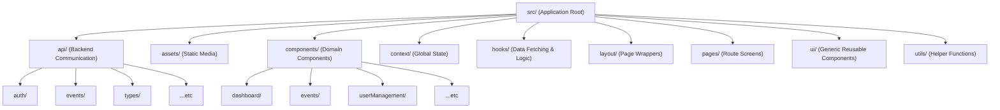

# EvaTrack Frontend Structure

Your frontend architecture follows a highly scalable, **Feature-Driven (or Domain-Driven) Folder Structure** mixed with a clear separation of generic vs. domain-specific logic. This is widely considered the gold standard for large React applications.

By keeping feature components grouped together (e.g., everything related to `events` in one folder), you make the codebase incredibly easy to navigate and scale without causing a "flat-folder nightmare" where hundreds of files sit in a single `components/` directory.

Here is the breakdown of your project structure and its uses:

## Directory Diagram

---

## Detailed Folder Descriptions

### 1. `src/api/`
**Purpose:** Handles all communication with your backend server.
**Structure:** Grouped strictly by domain (e.g., `alerts/`, `auth/`, `households/`). 
**Why it's good:** This prevents having a massive `api.js` file. Also, the `types/` subfolder strongly types your API responses, ensuring TypeScript (or JSDoc) can validate your data payloads.

### 2. `src/components/`
**Purpose:** Houses all domain-specific React components.
**Structure:** Grouped by feature module (e.g., `analytics/`, `dashboard/`, `events/`).
**Why it's good:** Instead of putting `EventModal.jsx`, `ActiveEventsList.jsx`, and `AssignCentersModal.jsx` in a single flat directory with 100 other files, they live neatly inside `components/events/`. This makes locating the UI pieces for a specific feature instantaneous.

### 3. `src/ui/`
**Purpose:** Contains the core "Design System" of your application.
**Structure:** Flat generic components (`Button.jsx`, `Input.jsx`, `Table.jsx`, `Modal.jsx`, `Select.jsx`).
**Why it's good:** These components hold no domain logic (they don't know what an "Event" or "Household" is). They simply take props and render beautifully styled UI. This is exactly what we just successfully standardized across the entire app!

### 4. `src/hooks/`
**Purpose:** Custom React Hooks that manage complex state or data fetching.
**Structure:** Domain-specific hooks like `useCenterIssueReports.ts` and `useUserManagement.ts`.
**Why it's good:** It completely removes heavy data-fetching logic and state management from your UI components, keeping your `pages/` clean and focused solely on rendering.

### 5. `src/pages/`
**Purpose:** The top-level route components representing full screen views.
**Structure:** Files like `Dashboard.jsx`, `Analytics.jsx`, `Profile.jsx`.
**Why it's good:** It maps perfectly to your React Router setup. Pages simply assemble the domain components from `src/components/` and the logic from `src/hooks/`.

### 6. `src/layout/`
**Purpose:** Wrappers that dictate the structural layout of the pages.
**Structure:** `DashboardLayout.jsx` (which likely includes the Sidebar and Navbar).
**Why it's good:** It ensures that structural elements don't need to be re-imported and re-rendered on every single page component.

### 7. `src/context/`
**Purpose:** Global React Context providers.
**Structure:** Files like `AlertContext.jsx`.
**Why it's good:** Perfect for data that needs to be accessible everywhere (like the logged-in user, theme, or global alert notifications) without prop-drilling down 10 levels deep.

### 8. `src/assets/` & `src/utils/`
**Purpose:** `assets/` holds images, SVGs, and static media. `utils/` holds pure, non-React Javascript helper functions (like formatting dates, geocoding, or role-checking).
