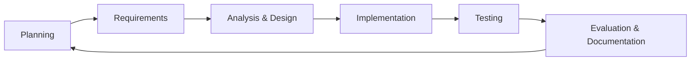

# CHAPTER 3  
# METHODOLOGY

---

## Research Design

This study uses a **mixed-methods** approach:

- **Descriptive research** — documents the current evacuation process and user needs.
- **Development research (R&D)** — designs and builds the EvaTrack system artifact.
- **Evaluative research** — assesses the system against objectives using testing and user feedback.

---

## System Development Life Cycle (SDLC)

The team adopted an **Agile-inspired iterative model** suitable for capstone timelines:

| Phase | Activities | Researcher role |
|-------|------------|-----------------|
| **Planning** | Problem definition, objectives, scope | Lead Ch. 1, coordinate scope with team |
| **Requirements** | Interviews, surveys, use cases | Lead requirements doc |
| **Analysis** | AS-IS/TO-BE, ERD review | Process flows, literature link |
| **Design** | UI mockups, API design, DB schema | Document architecture in thesis |
| **Implementation** | React frontend, Laravel API | Support with specs from requirements |
| **Testing** | Unit, integration, UAT | Trace tests to objectives |
| **Deployment** | Local/server hosting | Document environment setup |
| **Evaluation** | ISO 25010 questionnaire | Analyze results for Ch. 4/5 |

---

## Requirements Gathering Methods

### 1. Interview (semi-structured)
- **Participants:** Barangay captain/ kagawad, DRRM coordinator, evacuation center manager, 1–2 center volunteers.
- **Duration:** 20–30 minutes each.
- **Topics:** Current evacuation steps, tools used, pain points, data needed during typhoon/flood, acceptance of QR/web system.
- **Instrument:** See `REQUIREMENTS-GATHERING.md` (question guide).

### 2. Survey questionnaire (optional)
- **Participants:** 30–50 residents or barangay staff (Google Forms).
- **Format:** Likert scale + open-ended.
- **Topics:** Awareness of centers, preferred alert channel, willingness to pre-register household.

### 3. Document analysis
- Review barangay DRRM plan, evacuation center list, sample logbook forms (if available).
- Compare with NDRRMC barangay checklist templates.

### 4. Observation (if permitted)
- Observe a drill or simulate admission desk flow; time the steps for AS-IS metrics.

---

## Sampling

- **Purposive sampling** — informants selected because they hold DRRM or center roles.
- **Inclusion:** Officials/staff with at least one year involvement in community disaster preparedness OR recent drill experience.
- **Exclusion:** Respondents outside the target barangay/municipality (unless comparative).

Document: number of respondents, dates, and consent in **Appendix A**.

---

## System Architecture and Tools

| Layer | Technology |
|-------|------------|
| Frontend | React 18, Vite, Tailwind CSS, React Router, Leaflet, Axios |
| Backend | Laravel, Laravel Sanctum (API auth + CSRF cookies) |
| Database | MySQL (`klint` schema, `mysql_v2` connection) |
| Notifications | OneSignal, TextBee (SMS) — configurable |
| Mapping / routing | OpenStreetMap tiles, OSRM routing API |
| Version control | Git |
| IDE | VS Code, Cursor |

**Architecture pattern:** Client-server; RESTful API; role-based access control on API routes.

---

## Data Collection for Evaluation

After implementation:

1. **Functional testing** — test cases per module (auth, events, alerts, admit, allocate, etc.).
2. **User acceptance testing (UAT)** — 5–10 end users perform scripted tasks; record pass/fail and time.
3. **Usability survey** — System Usability Scale (SUS) or custom Likert questionnaire.
4. **Performance spot-check** — page load and API response under normal LAN conditions.

Metrics aligned to objectives:

| Objective | Metric |
|-----------|--------|
| Faster verification | Average time to admit one household (AS-IS vs TO-BE) |
| Capacity visibility | Users can correctly identify full centers on public page |
| Usability | Mean SUS score ≥ 68 (industry benchmark) |
| Reliability | % of test cases passed |

---

## Ethical Considerations

- Obtain **verbal/written consent** from interviewees.
- Anonymize names in thesis unless officials agree to be identified.
- Do not publish real evacuee personal data; use test households in demos.
- Secure `.env` secrets (API keys, DB passwords) and do not commit to public repos.

---

## Project Schedule (Gantt — adjust dates)

| Week | Task |
|------|------|
| 1–2 | Literature review, Chapter 1 draft |
| 3–4 | Interviews/surveys, requirements doc |
| 5–6 | System analysis, Chapter 2–3, design approval |
| 7–10 | Development (parallel with team) |
| 11–12 | Testing, UAT, evaluation |
| 13–14 | Final paper, defense prep |

---

*Researcher: maintain a research log (date, activity, evidence) for adviser meetings.*
