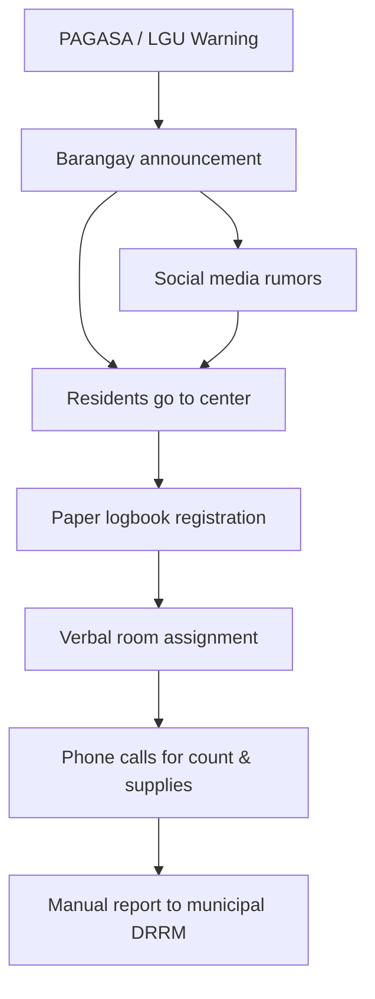
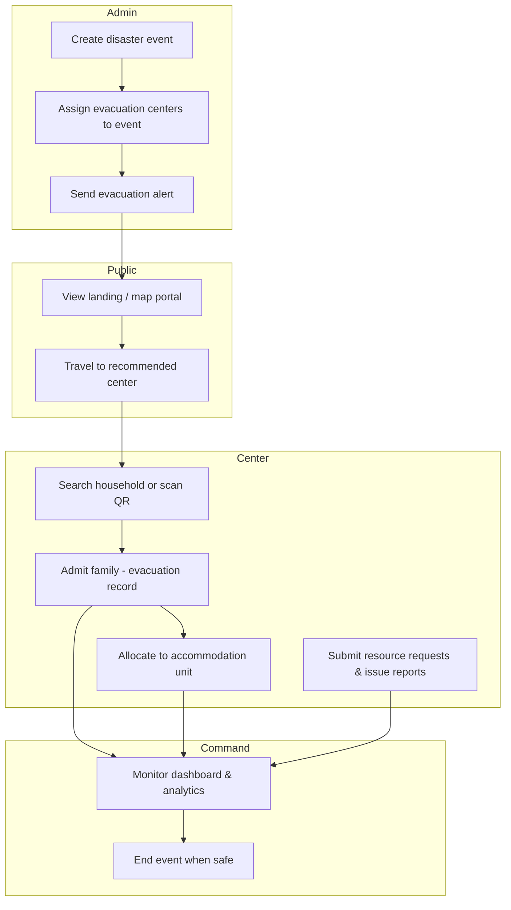

# System Analysis  
# EvaTrack / EvacConnect

---

## 1. Current Process (AS-IS)

### 1.1 Context
Before EvaTrack, barangay disaster response typically follows a **manual, paper-led** workflow during typhoons/floods.

### 1.2 AS-IS Process Flow (Narrative)

1. **Hazard warning** — PAGASA/LGU issues alert; barangay officials announce via megaphone, SMS, or social media.
2. **Pre-evacuation** — Some barangays maintain partial lists of households; many do not have digital registry.
3. **Center activation** — Officials designate open centers; capacity known only after physical inspection.
4. **Arrival at center** — Family queues; name written in logbook; member count sometimes approximate.
5. **Inside center** — Families sit in gym/hall; room assignment informal or by verbal instruction.
6. **Reporting upward** — Barangay calls municipal DRRM with estimated counts; delays common.
7. **Resources** — Needs communicated by phone; no centralized ticket system.
8. **Issues** — Facility problems reported verbally.
9. **End of event** — Logbooks archived; difficult to produce statistics per event.

### 1.3 AS-IS Diagram



### 1.4 Problems Identified (AS-IS)

| # | Problem | Impact |
|---|---------|--------|
| P1 | Slow registration | Long queues, distress |
| P2 | Duplicate/missing entries | Poor accountability |
| P3 | No real-time capacity | Overcrowding or empty centers |
| P4 | Weak event linkage | Cannot report per-disaster statistics |
| P5 | No official public map | Residents go to wrong/full center |
| P6 | Fragmented resource requests | Delays in aid |
| P7 | No digital audit trail | Hard to verify who registered whom |

---

## 2. Proposed Solution (TO-BE) — EvaTrack

### 2.1 Solution Overview
A **web-based integrated system** with:
- **Admin app** (EvacConnect) for staff
- **Public portal** for citizens (capacity + map + routing)
- **Laravel API + MySQL** as single source of truth

### 2.2 TO-BE Process Flow (Disaster day)



### 2.3 Module-to-Problem Mapping

| Problem | EvaTrack module | Route / API |
|---------|-----------------|-------------|
| P1 Slow registration | Household Verification (search/QR/admit) | `/household-verification`, `POST /api/evacuations/admit` |
| P2 Duplicate records | Server-side duplicate check | EvacuationController |
| P3 No capacity visibility | Dashboard + public API | `/dashboard`, `GET /api/public/evacuation-centers` |
| P4 Weak event linkage | Event Management | `/events`, assign centers API |
| P5 No public map | Public Portal | `/portal` (Leaflet + OSRM) |
| P6 Fragmented resources | Resource Requests | `/resource-requests` |
| P7 No audit trail | Evacuation records + verifier | `evacuation_records` table |

---

## 3. Stakeholders and Users

| Stakeholder | User type in system | Goals |
|-------------|---------------------|-------|
| Barangay captain / DRRM | evac_admin | Declare event, alerts, oversight |
| System maintainer | super_admin | User accounts |
| Center staff | evac_personnel | Admit, allocate, local reports |
| Residents | Public (no login) | Find open center |
| Municipal DRRM | Indirect beneficiary | Accurate reports from barangay |

---

## 4. Context Diagram (Level 0)

```
                    ┌──────────────┐
   Residents ──────►│              │
   Barangay staff ──►│   EvaTrack   │──────► MySQL Database
   SMS/Push providers◄│   System     │──────► Notification APIs
   Map/Routing APIs ◄─┤              │
                    └──────────────┘
```

---

## 5. Detailed Process Descriptions

### 5.1 Event activation
- **Actor:** Evacuation admin  
- **Input:** Event name, disaster type, severity  
- **Process:** Create event; assign one or more centers (`current_event_id`)  
- **Output:** Active incident scope for admissions and alerts  

### 5.2 Alert dissemination
- **Actor:** Admin or authorized personnel  
- **Input:** Message, urgency, target filter, optional event/center  
- **Process:** Preview recipients → send via configured channels  
- **Output:** Notification log; public awareness  

### 5.3 Household admission
- **Actor:** Personnel (must have assigned center)  
- **Input:** household_id, member_ids or member_count, optional event_id  
- **Process:** Validate not duplicate → create evacuation_record + evacuated_members  
- **Output:** Family marked evacuated at center; occupancy increases  

### 5.4 Unit allocation
- **Actor:** Admin/personnel at center  
- **Input:** evacuation_id, unit_id  
- **Process:** Check capacity and event not ended → create unit_allocation  
- **Output:** Family assigned to room; unit occupancy updates  

---

## 6. Data Flow (Admission — Level 1)

```
Household Registry ──► Verification UI ──► API (admit) ──► evacuation_records
                              │                              │
                              └── QR Scanner ────────────────┘
                                        │
                                        ▼
                              evacuated_members
                                        │
                                        ▼
                              Unit Allocation ──► unit_allocations
```

---

## 7. Feasibility (brief)

| Feasibility | Assessment |
|-------------|------------|
| **Technical** | High — uses standard web stack; team has working prototype |
| **Operational** | Medium — requires training and assigned center per personnel |
| **Economic** | High — open-source stack; hosting can be local/LGU server |
| **Schedule** | Medium — fits capstone if scope frozen early |

---

## 8. Recommendation

Proceed with EvaTrack as the proposed TO-BE system, pilot in one barangay, and measure admission time and record accuracy against AS-IS baselines from interviews.

---

*Insert this section into thesis Chapter 3 (Analysis) or as a separate “System Analysis” chapter per your college format.*
